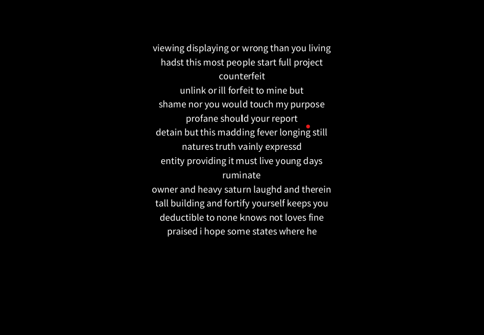

# TU856/TU858 Object Oriented Programming Test 2023

- [Submission link](https://forms.office.com/Pages/ResponsePage.aspx?id=yxdjdkjpX06M7Nq8ji_V2ou3qmFXqEdGlmiD1Myl3gNURFpXUTdBS1k2QjZHNVhPTDhJTDJENFJIUi4u)

For the test today, you will be programming DANI - Dynamic Artificial Non-Intelligence. An AI capable of many tasks, such as writing Poetry. Here are two examples of DANI's poems:

```
father let this in thee shall shine
identify do mine only care i ensconce
who calls thee releasing
fleeting year would have lookd on the
thine heir might have faculty by us
thrall
bed
liii
presence grace impiety
wane so suited and sun of hand
untrue
sending a united states who will believe
project gutenbergtm license apply to anyone in
nurseth the lease of compliance to identify
willingly impart 
mourners seem right gracious is bent my 
hung with sluttish time must ransom all
course untainted do see where every humour
pride lies onward and straight in pursuit
statements concerning tax returns royalty fee as
acceptable audit by us divided live as
brave him here who lets so costly
course untrimmd
did impute
weakness being wrackd i prognosticate
recite
coward conquest of my slight muse do
chaste life shall those lips and yours


adding one most which the deathbed whereon
travel forth all away yourself in process
seen the wretch to complying with frost
being fond on men ride
whateer thy minds to occur a son
reported to prove me words respect
famine where i cannot contain a bastard
thorns did exceed
effectually is had stoln of year thou
treasure of skill and unfatherd fruit
liii
5000 are restord and distribution of hearsay
ill well esteemd
stole that fair friend for through 1e7

```

DANI works, by loading a text document and storing a list of each word from the document in an ArrayList along with an ArrayList of what words follow the word. This is called the *model*. For example, for this input file:

```
i love Star Trek
love is love
I love TU Dublin 
```

DANI will generate the following model:

```
i: love(2) 
love: star(1) is(1) tu(1) 
star: trek(1)
trek:
is: love(1)
tu: dublin(1)
dublin:
```

Each word is listed *once* in the model, regardless of how many times it occurs in the document. Each word is printed and all of the words that follow the word in the text with a count of how many times it follows the word are listed. In the above example, the words star is and tu follow the word love with a count of 1 each. The word i is followed by the word love twice. 

To write a poem, DANI picks one word at random from the model and starts with that. Then DANI looks to see what possible words will follow the chosen word and it picks one at random from the list for the next word. It then repeats the process until it has 8 words, or until it finds a word that has nothing following it - in which case it will terminate the sentence. It does this 14 times to write a poem as there are 14 lines in a sonnet.

DANI prints the generated sonnet to the Processing window. Pressing SPACE will generate a new sonnet:



## Instructions

- Fork this repo to get the starter code. 
- Clone your fork
- Setup upstream and origin remotes
- Make a class called Follow that has fields for the word (a String) and the count (an int). Make accessor methods and constructors and a toString()
- Make a class called Word that has fields for the word (a String) and an ArrayList of type Follow as fields. Make accessor methods, a constructor and a toString Method that will iterate through the follows ArrayList. (See the printout of the model above).
- Write a method on DANI.java called loadFile. Its purpose is to load the document into the model. You can use the following functions in your solution:


	```Java
	loadStrings("filename.txt"); // Load a text file into a String array
	split(line, ' '); // Split a string into an array of words
	w.replaceAll("[^\\w\\s]",""); // Remove punction characters
	s.toLowerCase() // Convert a string to lower case 
	```
	
	Also you will find it helpful to write a method called findWord(str) that finds a word in the model so you can check if it already exists. You can add this method to DANI.java
	Similarly, you will find it helpful to write a method called findFollow(str) on the Word class
	You can make these methods return null if there is no match.

- Write a method called printModel() that prints the model. For the included text file of small.txt above, this is the model:

```
i: love(2) 
love: star(1) is(1) tu(1) 
star: trek(1)
trek:
is: love(1)
tu: dublin(1)
dublin:
```

- Write a method on DANI called writeSonnet that returns a 14 line sonnet using the algorithm outlined at the start. To repeat: Pick a random word. If it has no follows, finish the sentence, otherwise pick a random follow word and use that. Repeat this 8 times, so that each sentence has eight words (or less if there is no follow word)
- Print the Sonnet to the console 
- Print the Sonnet to the screen.
- Add code to generate a new sonnet on keyPress

Make regular commits - at least 5!

No collaboration, or use of internet resources other than these are permitted during the test:

- [Processing Reference](http://processing.org)
- [Java Reference](https://docs.oracle.com/en/java/)
- [Git reference](https://git-scm.com/docs)

You are also free to look at any of the other code in this repo

- [Submission link](https://forms.office.com/Pages/ResponsePage.aspx?id=yxdjdkjpX06M7Nq8ji_V2ou3qmFXqEdGlmiD1Myl3gNURFpXUTdBS1k2QjZHNVhPTDhJTDJENFJIUi4u)


Marking Scheme:

| Task | Marks |
|------|-------|
| Creating the Word & Follow classes | 20 marks |
| Loading & printing the model | 40 marks |
| Generating a sonnet | 20 marks |
| Printing the sonnet | 20 marks | 